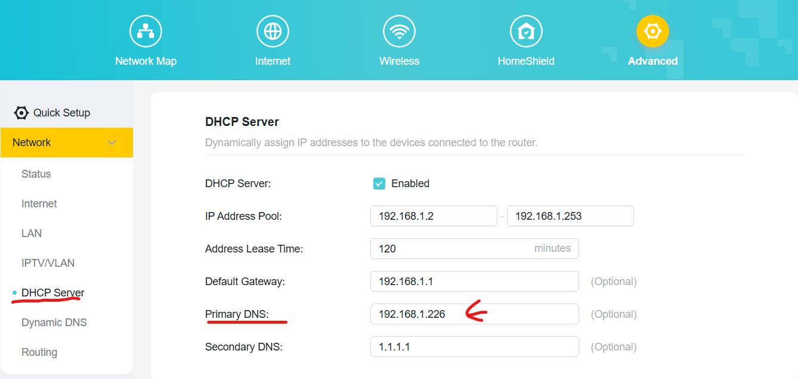
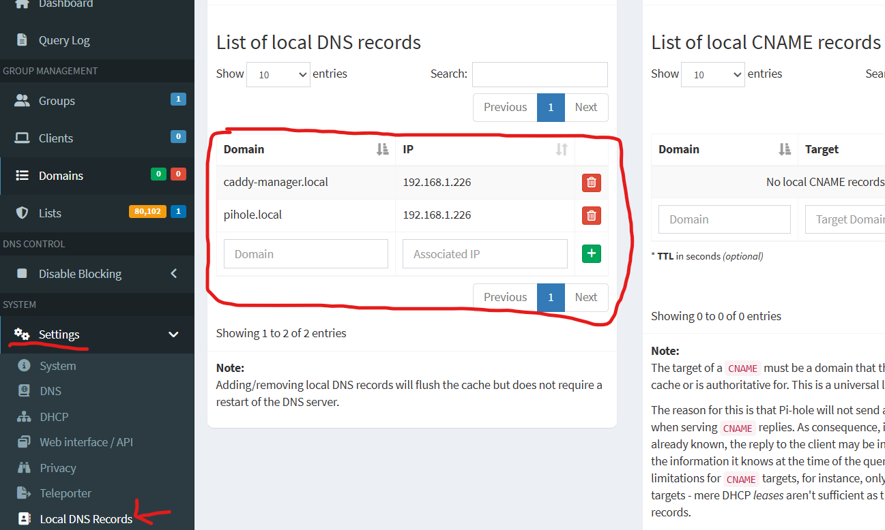

## PiHole

---

### Setup primary DNS

---

Once PiHole is running in docker your need to configure your router's primary DNS to PiHole's hosting server/machine IP.


### Setup DNS record for local network

---

**Caddy reverse proxy required domain in order to work in local network**. You need to setup DNS records in PiHole so that your Caddy reverse proxy can use the domain to do reverse proxy in local network.


**Make sure you use these domain in your caddy configuration file(Caddyfile)**.

```
{
        debug
        acme_ca https://acme-staging-v02.api.letsencrypt.org/directory
}

# PiHole dashboard
pihole.local {
        redir / /admin
        reverse_proxy pihole:80
}

# Caddy manager dashboard
caddy-manager.local {
        reverse_proxy caddymanager-frontend:80
}
```
